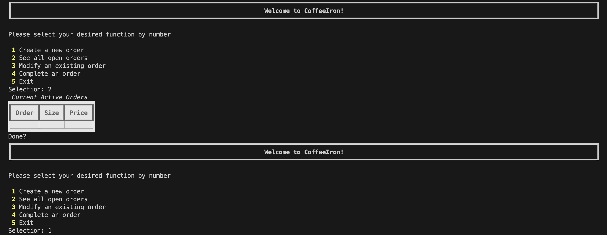
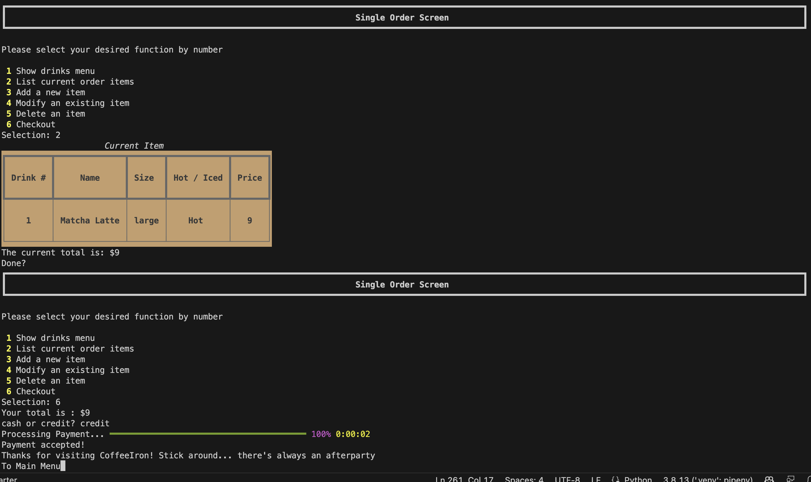

# CoffeeIron 

CoffeeIron is a CLI application that allows a barista to take coffee orders, modify, delete and checkout orders. 
This README file will explain how to use the application and how each function works.


## Installation and Prerequisites

To run the CoffeeIron app, you will need:


1.Python 3.5 or higher
2.SQLAlchemy
3.Rich Library 

You can install the required libraries by running the following command in your terminal:


```$ pipenv install``

Now that your environment is set up, run `pipenv shell` to enter it.

How to Use the App
To start the CoffeeIron app, `cd` into the `lib` directory, then run:

```$ python cli.py```


## Usage

Upon running the script, the user is greeted with the main menu. The user can select an option by entering the corresponding number.


## Files:

### cli.py

This file is super important for our Coffee Shop App. It imports necessary modules such as create_engine and sessionmaker from SQLAlchemy, as well as custom classes from models.py. 

The CLI class is defined with methods such as start, new_order, and handle_order to interact with the user by adding, modifying, and deleting items. print_menu displays the menu of drinks available for order, and checkout calculates the total price of the order and prints out a message confirming the checkout process.


### models.py

The models.py file contains the database schema for the CoffeeIron ordering system. It defines three tables using SQLAlchemy: Drinks, Add_Drinks, and Orders.

### seed.py

The seed.py file is used to populate the database with initial data. It imports the necessary modules and creates an instance of the engine and session to interact with the database. It then creates instances of the Drinks class, which represent the different drinks offered by the coffee shop, and adds them to the database. 

### coffeeiron.db

coffeiron.db is our SQLite database file that is used to store information about the drinks menu and orders. The database schema includes three tables: "drinks", "add_drinks", and "orders".  

## Functions:


**start()**
The start function displays a message and prompts the user for input, which is then used to call other functions.
1. Create a new order
2. See all open orders
3. Modify an existing order
4. Delete an order
5. Exit

**handle_order()**
The handle_order function takes an order item and allows the user to select the following features: 

 1. Show drinks menu
 2. List current order items
 3. Add a new item
 4. Modify an existing item
 5. Delete an item
 6. Checkout 


**create_table_list()**
Creates a table of all current active orders and their corresponding items and prices.

**new_order()**
This function creates a new order and opens the single order screen.

**print_menu()**
It displays a table of all the available drinks and their corresponding sizes and prices.

**list_items()**
list_items displays a table of all the items currently in the order and their corresponding sizes and prices.

**add_item()**
This is one of our CRUD functions, and it allows users to add a new drink to the order and calculate the price based on size and drink name.

**modify_item()**
modify_items allows the user to update an existing drink order by selecting the item ID, specifying the field to update, and entering the new value. 

**delete_item()**
As the name specifies, the user can delete an existing item from either the Add_Drinks or Orders table by selecting the ID. It also deletes any associated items from the Add_Drinks table if an order is deleted.

**checkout()**
The checkout function is responsible for generating the final bill for the customer and processing the payment. It takes the price_total as an argument, which is the total cost of the order, and prompts the customer to select either cash or credit as the payment method.

## Models

CoffeeIron utilizes a many-many relationship schema, and it features three important models:

Drinks defines the basic information for each type of drink available in the CoffeeIron menu, including the name, description, and price.

Add_Drinks represents a specific instance of a drink that is added to an order, including details like size, whether it's hot or cold, and the price based on the size.

Orders represents an order instance and includes the time it was ordered and the total price of the order.

## App Screenshots

### First Screen



### Menu Items


### Checkout




## References

[SQLalchemy](https://www.sqlalchemy.org/)

[Rich Documentation](https://rich.readthedocs.io/en/stable/introduction.html)


